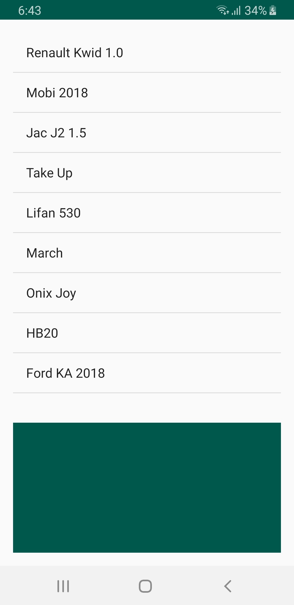
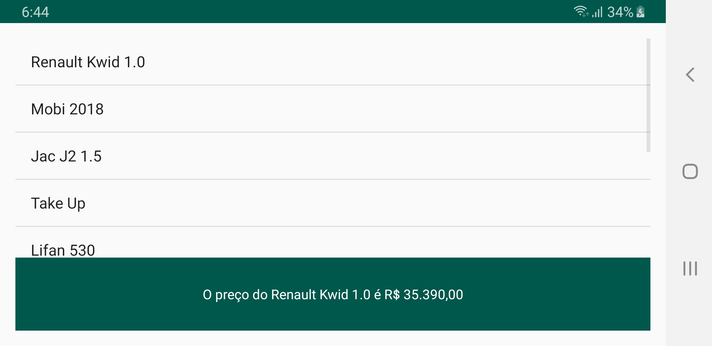

# Exemplo comunicação entre fragments
Exemplo de comunicação entre <b>fragments</b> utilizando uma interface para um fragment se comunicar com o outro, fazendo uso da <b>Activity</b> como "ponte".

   
  

### Licença
Este repositório está disponível sob a licença [Mozilla Public License, version 2.0](https://github.com/jhonatasrm/exemplo-comunicacao-entre-fragments/blob/master/LICENSE)
